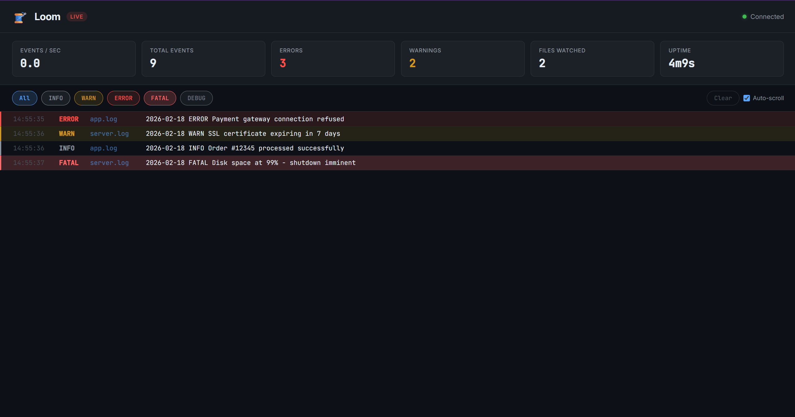

<div align="center">

# 🧵 Loom

**Log-Observer & Monitor**

A high-performance, real-time log aggregation CLI tool with a live web dashboard.

[](https://go.dev)
[](LICENSE)
[]()

[Features](#-features) · [Install](#-installation) · [Quick Start](#-quick-start) · [Dashboard](#-dashboard) · [Config](#-configuration) · [Architecture](#-architecture)

</div>

---

## ✨ Features

- **🔍 Multi-source Tailing** — Watch multiple log files or entire directories simultaneously
- **📐 Structured Parsing** — Auto-detect JSON, Common Log Format, or use custom Regex patterns
- **⚡ High Throughput** — 500K–970K lines/sec parsing, <50MB RAM via Go's concurrency pipeline
- **📊 Live Dashboard** — Real-time WebSocket-powered UI for log trends, error rates, and EPS metrics
- **🔄 Resilient Rotation** — Automatic reconnection on log file rotation with state checkpointing
- **📦 Single Binary** — Frontend assets embedded via `go:embed` — no external dependencies at runtime
- **🔬 Built-in Profiling** — `pprof` endpoints for CPU/memory analysis in production

---

## 📥 Installation

### From Source

```bash
git clone https://github.com/atikulmunna/loom.git
cd loom
go build -o loom ./cmd/loom
```

### Go Install

```bash
go install github.com/atikulmunna/loom/cmd/loom@latest
```

---

## 🚀 Quick Start

### Watch a single file

```bash
loom watch /var/log/app.log
```

### Watch multiple files with glob patterns

```bash
loom watch "/var/log/**/*.log"
```

### Filter by severity

```bash
loom watch /var/log/app.log --level error,warn
```

### Use a specific parser

```bash
# Apache/Nginx Common Log Format
loom watch /var/log/nginx/access.log --format clf

# Custom regex with named capture groups
loom watch app.log --format regex --pattern '^(?P<timestamp>\S+) (?P<level>\w+) (?P<message>.+)$'
```

### JSON output for piping

```bash
loom watch /var/log/app.log --output json | jq '.level == "ERROR"'
```

### Start with the web dashboard

```bash
loom watch /var/log/app.log --serve --port 8080
```

Then open [http://localhost:8080](http://localhost:8080) in your browser.

---

## 📊 Dashboard




| Metric | Description |
|:-------|:------------|
| **Events/sec** | Live throughput gauge |
| **Error/Warning Count** | Running totals of ERROR and WARN entries |
| **Log Stream** | Filterable, color-coded live log feed with severity toggles |
| **Uptime & File Count** | How long Loom has been running and how many files are watched |

### API Endpoints

| Route | Description |
|:------|:------------|
| `GET /` | Dashboard UI |
| `GET /healthz` | JSON health check |
| `GET /api/stats` | Aggregator metrics snapshot |
| `GET /ws` | WebSocket log stream |
| `GET /debug/pprof/*` | pprof profiling endpoints |

---

## ⚙️ Configuration

Loom uses a YAML config file. Default location: `~/.loom.yaml`

```yaml
# ~/.loom.yaml

watch:
  paths:
    - /var/log/app/*.log
    - /var/log/nginx/access.log
  recursive: true

parser:
  format: auto  # auto | json | clf | regex
  custom_regex: '^(?P<timestamp>\S+) (?P<level>\w+) (?P<message>.+)$'

server:
  enabled: true
  port: 8080
```

### CLI Flags

| Flag | Short | Description | Default |
|:-----|:------|:------------|:--------|
| `--level` | `-l` | Filter by log severity | all |
| `--output` | `-o` | Output format (`text`, `json`) | `text` |
| `--format` | `-f` | Parser format (`auto`, `json`, `clf`, `regex`) | `auto` |
| `--pattern` | `-p` | Custom regex pattern (with `--format regex`) | — |
| `--serve` | `-s` | Enable web dashboard | `false` |
| `--port` | | Dashboard port | `8080` |
| `--config` | `-c` | Config file path | `~/.loom.yaml` |

---

## 🏗️ Architecture

Loom uses a **Fan-in concurrency pipeline** built on Go channels:

```
┌──────────────┐
│  Log File A  │──┐
└──────────────┘  │    ┌──────────┐    ┌─────────┐    ┌────────────────┐
                  ├───▶│  Tailer  │───▶│   Hub   │───▶│  CLI Output    │
┌──────────────┐  │    │(Raw Lines)│   │(Parse + │    ├────────────────┤
│  Log File B  │──┤    └──────────┘    │Broadcast)│   │  WebSocket UI  │
└──────────────┘  │                    └────┬────┘    ├────────────────┤
                  │                         │         │  Aggregator    │
┌──────────────┐  │                         ▼         └────────────────┘
│  Log File N  │──┘                    ┌──────────┐
└──────────────┘                       │  Parser  │
     Watcher                           │(JSON/CLF/│
   (fsnotify)                          │Regex/Auto)│
                                       └──────────┘
```

| Component | Responsibility |
|:----------|:---------------|
| **Watcher** | OS-level file notifications via `fsnotify`, glob pattern support |
| **Tailer** | Offset-based tailing with checkpointing, rotation reconnect |
| **Parser** | JSON, CLF, Regex, or Auto-detect structured log parsing |
| **Hub** | Central channel-based broadcaster with backpressure drop policy |
| **Aggregator** | Time-windowed metrics: EPS, level counts, uptime |
| **Server** | Gin web server with `go:embed`, WebSocket, and pprof |

---

## 🧰 Tech Stack

| Category | Technology |
|:---------|:-----------|
| Language | [Go 1.22+](https://go.dev) |
| CLI Framework | [Cobra](https://github.com/spf13/cobra) |
| Config | [Viper](https://github.com/spf13/viper) |
| File Watching | [fsnotify](https://github.com/fsnotify/fsnotify) |
| Web Server | [Gin](https://github.com/gin-gonic/gin) |
| WebSocket | [Gorilla WebSocket](https://github.com/gorilla/websocket) |
| TUI Styling | [Lip Gloss](https://github.com/charmbracelet/lipgloss) |
| Profiling | [pprof](https://pkg.go.dev/net/http/pprof) |

---

## 🧪 Testing

```bash
# Run all tests (18 tests across 5 packages)
go test ./...

# Run with coverage
go test -coverprofile=coverage.out ./...
go tool cover -html=coverage.out

# Run benchmarks
go test -bench=. -benchmem ./internal/parser/
go test -bench=. -benchmem ./internal/hub/
```

---

## 📈 Performance

Benchmarked on **AMD Ryzen 9 8945HX** (Windows, amd64):

### Parser Throughput

| Parser | ops/sec | ns/op | allocs/op |
|:-------|--------:|------:|----------:|
| **Regex** | 969K | 1,033 | 4 |
| **CLF** | 729K | 1,372 | 4 |
| **Auto-detect** | 714K | 1,401 | 8 |
| **JSON** | 474K | 2,108 | 35 |
| **Mixed (throughput)** | 583K | 1,715 | 7 |

### Hub Broadcast

| Subscribers | ops/sec | ns/op | allocs/op |
|:------------|--------:|------:|----------:|
| 1 | 7.9M | 126 | 2 |
| 5 | 13.3M | 101 | 2 |
| 10 | 9.2M | 143 | 2 |

---

## 🗺️ Roadmap

- [x] **Phase 1** — Core engine (Watcher, Tail, Checkpointing)
- [x] **Phase 2** — Processing pipeline (Parser, Hub, Filtering)
- [x] **Phase 3** — Web dashboard (Gin, WebSocket, go:embed)
- [x] **Phase 4** — Hardening (Tests, Profiling, Benchmarks)
- [ ] **Phase 5** — Alerting (Threshold triggers, webhook/Slack notifications)

---

## 🤝 Contributing

Contributions are welcome! Please follow these steps:

1. Fork the repository
2. Create a feature branch (`git checkout -b feature/amazing-feature`)
3. Commit your changes (`git commit -m 'feat: add amazing feature'`)
4. Push to the branch (`git push origin feature/amazing-feature`)
5. Open a Pull Request

Please use [Conventional Commits](https://www.conventionalcommits.org/) for commit messages.

---

## 📄 License

This project is licensed under the MIT License — see the [LICENSE](LICENSE) file for details.

---

<div align="center">

Built with ☕ and Go

</div>
